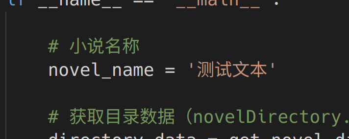

# Xrzww Novel Downloader
[](https://opensource.org/licenses/MIT)

「息壤中文网」小说下载器。该脚本仅供学习交流使用，请勿用于商业用途。

请配合 [息壤中文网 API 解析和文本解密](doc/xrzww_api.md) 使用。

## 运行环境

- Python 3.8+
- pycryptodome 3.21+

## 使用方法

1. 克隆项目并配置环境：

```bash
git clone https://github.com/swz128/xrzww_novel.git
cd xrzww_novel
pip install -r requirements.txt
```

2. 抓包获取 `novelDirectory.json` 文件，置于项目根目录

3. 修改 `novel_download.py` 中的变量：


4. 运行 `novel_download.py`

5. 修改 `novel_decrypted.py` 中的小说名称 `novel_name` ，并运行。小说会解密后保存在 `./output` 目录下。



## License

[MIT](LICENSE)

## 鸣谢

[息壤中文网](https://www.xrzww.com/)

[novel-downloader](https://github.com/404-novel-project/novel-downloader)