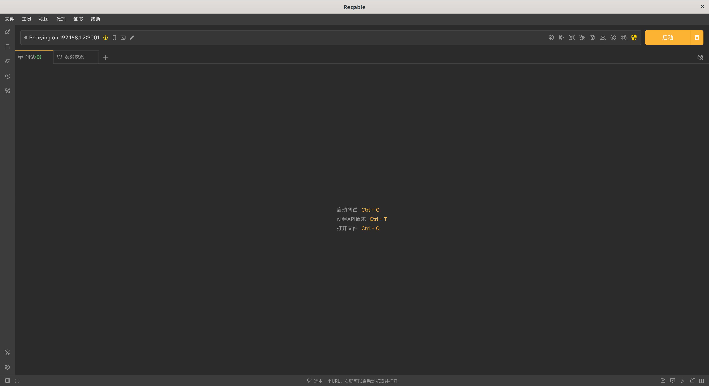
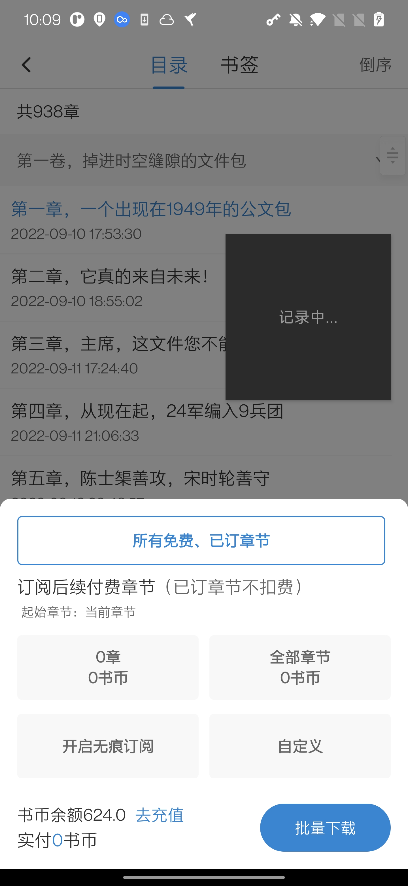
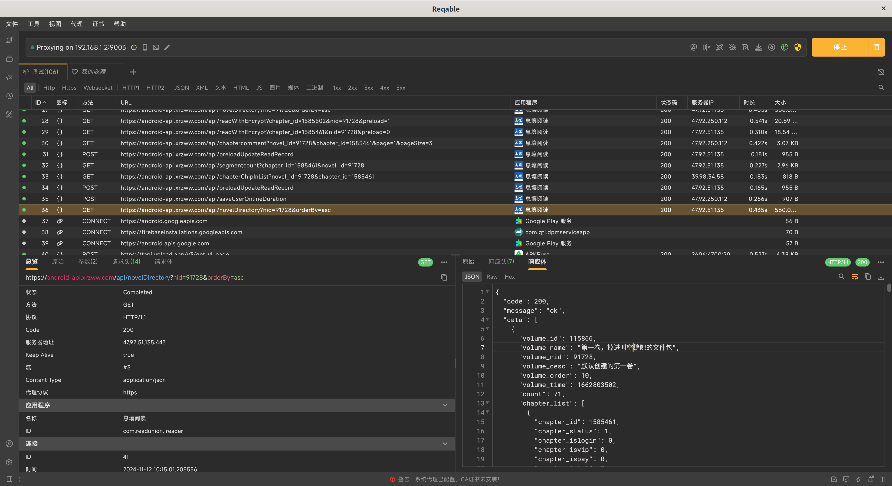
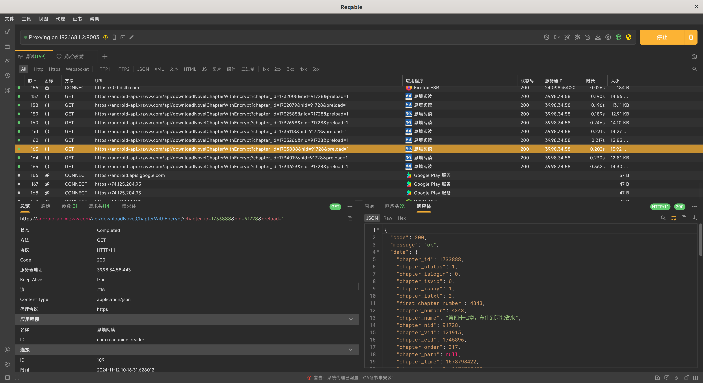
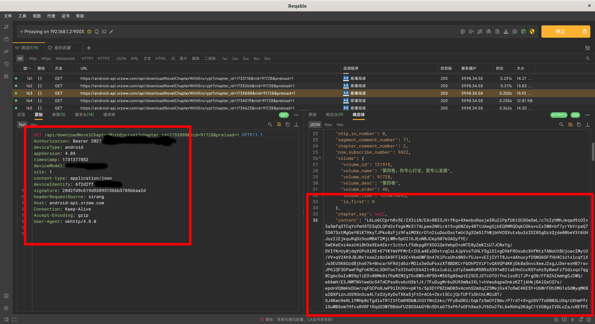
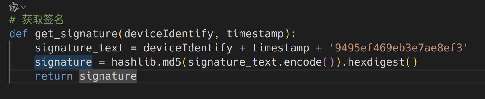
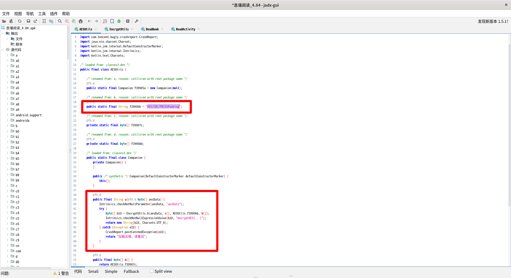
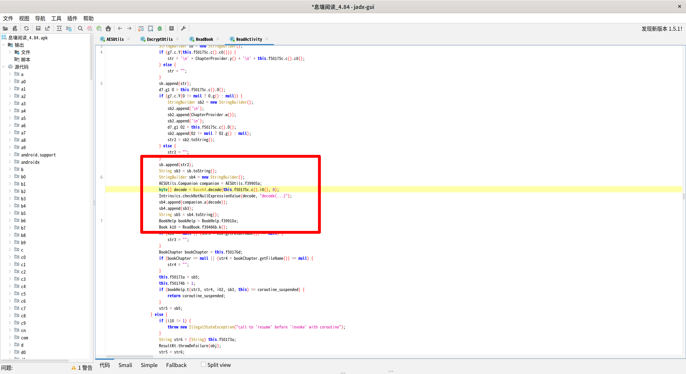
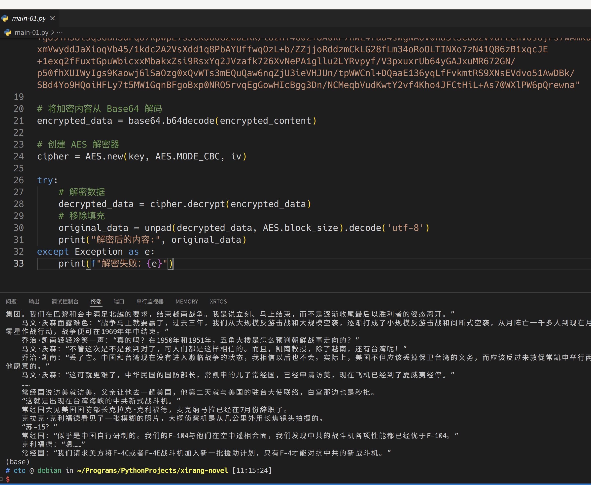

# 息壤中文网 API 解析和文本解密

之所以想对「息壤」进行解析和破解，是因为现在习惯了听书，以减轻眼睛的压力。但是息壤APP上的听书功能简直不堪入耳，所以只能想办法试试能不能把自己已经购买的章节下载下来，到第三方APP听书。

注意：本文只对自己已购买的章节的解密和下载进行介绍。

前提：需要自己有一台已 ROOT 的 Android 手机，也可以使用安卓模拟器，类似于 [雷电模拟器](https://www.ldmnq.com/)，并有一定的抓包调试基础，抓包软件 [Reqable](https://reqable.com/zh-CN/)。

## 一、抓包分析

抓包使用 Reqable，在抓包的时候发现，息壤 APP 会在启动时检测 ROOT 和代理，因此建议在 APP 启动后正常显示时再启动抓包。

进入你想下载的书的目录，点击「批量订阅」，然后就可以缓存章节。

在开始下载后可以发现，`https://android-api.xrzww.com/api/novelDirectory?nid=91728&orderBy=asc`，猜测这是获取小说目录的接口，查看响应体可以确认，并且通过此可以查看分卷情况和每一章的章节ID（chapter_id）。

继续抓包，在点击下载后可以发现，`https://android-api.xrzww.com/api/downloadNovelChapterWithEncrypt?chapter_id=1733888&nid=91728&preload=1` 接口是章节下载接口。

分析该接口的多个请求和响应可以发现，请求中需要关注的几个参数是 `Authorization`、`timestamp`、`deviceIdentify`、`signature`；响应中的 `content` 大概率是加密后的小说文本。

在这里感谢 [404-novel-project](https://github.com/404-novel-project/novel-downloader) 项目，通过该项目可得知请求头中的 `signature` 是对 `deviceIdentify`、`timestamp` 和 `9495ef469eb3e7ae8ef3` 进行 MD5 计算后取得的。在 Python 中验证后确认正确。

那么接下来就是对小说原文的解密了，但是截至目前（2024-11），**404-novel-project** 中对于息壤的小说解密已经过时，那么只能自己动手逆向分析一下APK了。

## 二、文本解密

首先通过手机上 **MT管理器** 提取息壤的 APK 安装包，使用 JADX 进行静态分析。

通过对密钥 `VT5aj59QCjf2J8F3`（来自 **404-novel-project**）的检索可以发现：密文大概率首先经过一次 AES，模式为 CBC，再进行一次 Base64 所得。

由此，在 Python 中验证：

猜测正确✔

那么接下来就能进行小说下载脚本的编写了。

## 三、小说下载脚本

详情请看 [Xrzww Novel](http://github.com/swz128/xrzww_novel)。